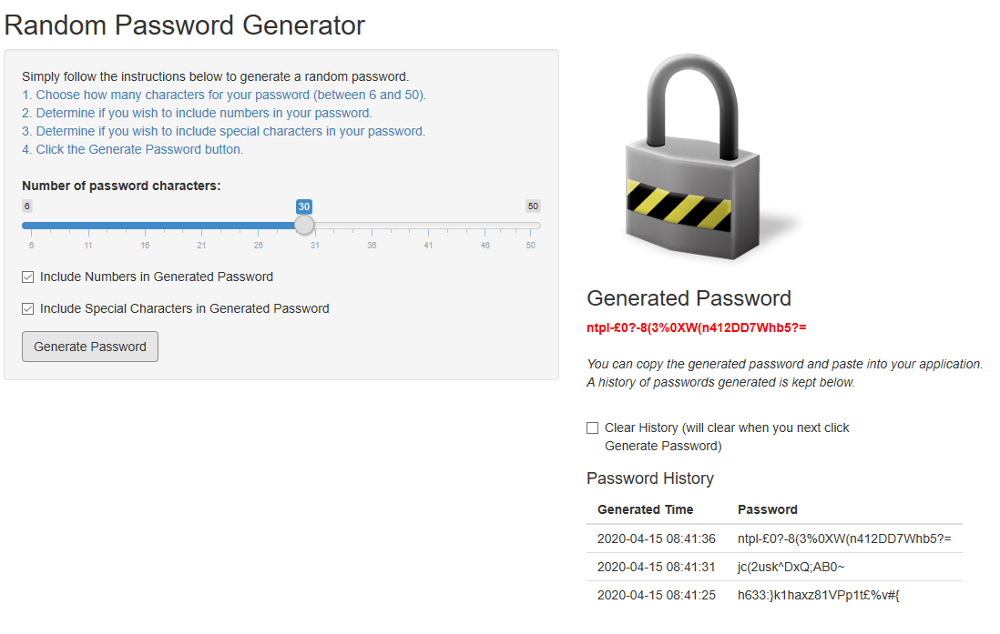
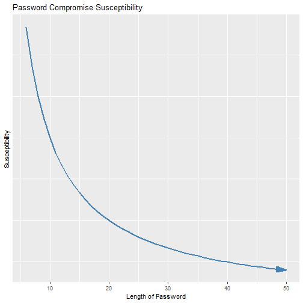

## Developing Data Products

### Password Generator App  
Simon Cox
IT Consultant

---

## Password Generator

* A brand new Shiny App available [here](https://coxy-74.shinyapps.io/Password-Generator/)  
<br>
* What does it do?  
    + Enables you to generate a random password  
    + You choose the size of the password  
    + You can include numbers and/or special characters  
    + A history of your passwords is maintained for reference  
<br>
* Why do you need it?  
    + You'll never have to invent new passwords again!
    + Your passwords will be randomised, making them very tough to break

---

## Intuitive and Simple to Use  


```r

```


---

## Security Is Everything

* As we know, we need to keep our passwords secure. We also need to make sure they are not easily breakable and susceptible to hackers.  
<br>
* The chart on the following slide shows how choosing a larger password makes it more secure, and less prone to being compromised.  
<br>
* As a bonus, I've included some R code used to generate the graphic!

---
## Bigger is Better


```r
suppressPackageStartupMessages(library(ggplot2))
mydf <- data.frame("x" = (6:50)); mydf$y <- 1/mydf$x
g <- ggplot(data = mydf, aes(x=x, y=y))
g + geom_line(arrow = arrow(angle = 15, type = "closed"), color = "steelblue", size = 1) +
    labs(title = "Password Compromise Susceptibility", x = "Length of Password", y = "Susceptibility") +
    theme(axis.text.y = element_blank(),axis.ticks.y = element_blank())
```



---
## Conclusion

* If you're serious about security, you'll use this app to generate all of your random passwords.  
<br>
<br>

#### Thank you


